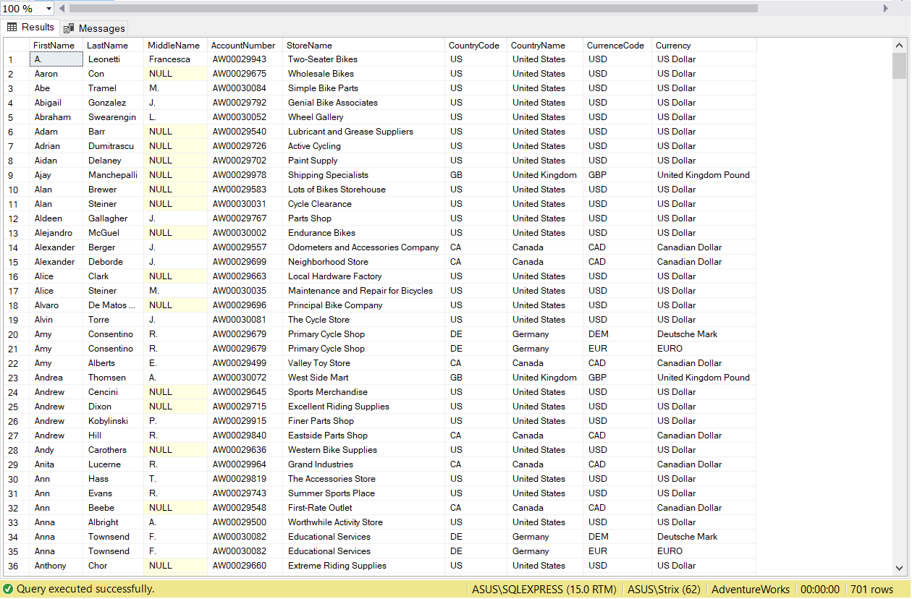
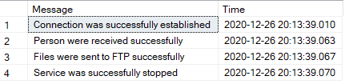

## Видео ##

В видео продемонстрированы следующие этапы:
* Запуск службы Service1 (FileWatcherAsync)
* Папки SourceDirectory, TargeteDirectory, OptionDirectory пусты
* Запуск службы DataManagerAsync
* Созданные xml и xsd файлы помещаюся в папку OptionDirectory, а затем отправляется на FTP сервер SourceDirectory
* Затем с помощью службы Service1 файл отправляется в TargetDirectory
* Продемонстрированы созданные файлы persons.xml 
* Показана заджойненная таблица в ms sql server
* Показана таблица логов Insights
* Остановлена работа служб Service1 и DataManager

Рис.1 Заджойнненая таблица

Рис.2 Таблица логов Insights

## Изменения в лабораторной работе №5 ##
Был произведен рефакторинг кода, таким образом было добавлено асинхронного поведения. Были изменены следующие элементы:

* Изменен класс Program в классе DataManagerAsync и в классе FileWatcherAsync
* Класс DataManager и Service1(FileWatcher)
* Классы DataIO, XmlGenerator, FileTransfer
* Классы в папке ServiceLibrary 
* Изменен класс Logger. Так получили асинхронный вариант класс Logger. Таким образом теперь мы можем передавать насколько файлов из SourceDirectory в TargetDirectory в разных потоках
* Также все операции ввода/вывода были изменены на асинхронный вариант

Во время работы программы весь лог записывается в таблицу Insihts (для службы DataManagerAsync) и в файл LogFile.txt (для службы FileWatcherAsync). Если на каком-либо этапе возникает изключение, то оно записывается в файл Exeption.txt
